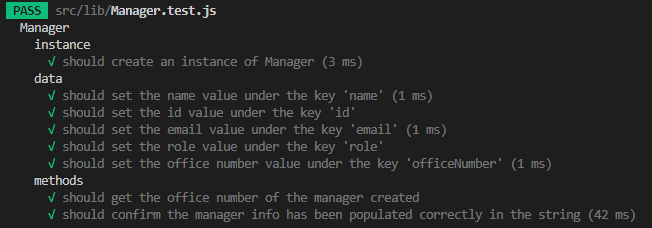

# Team profile generator


## Summary of the project and links

This is a team profile generator using node.js and the inquirer package.

Github repo: [Go to Repo](https://github.com/Am0031/team-profile-generator/tree/dev)
Demo video: [Go to Demo video](https://drive.google.com/file/d/1CH2OFQBZ5pyW4cKtX1qrRK81sBAKIvkC/view)

## Table of Contents

- [About the Project](#about-the-project)
- [Technologies](#technologies)
- [HTML Wireframe](#html-wireframe)
- [Main logic of the application](#main-logic-of-the-application)
- [Installation](#installation)
- [Demo video](#demo-video-of-the-application)
- [Test suites](#test-suites)
- [Contact me](#contact-me)

## About the Project

This application uses Node.js and the inquirer package to run through a set of questions and generate a html file from the answers provided.

When running the application, the user is presented with a series of prompts in the CLI, asking for information about their team and team members. When all the user responses have been gathered, the application generates a html file, with sections populated with employee cards reflecting the user's answers.

## Technologies

For this project, the following technologies and packages were used:

- Node.js v18.2.0 and NPM v8.9.0
- Node core packages: fs (for reading/writing into files), chalk (for CLI text colouring)
- Node external packages: inquirer (for user prompting and collecting answers), email-validator (for email format validation), change-case (for text formatting) and open (for opening a designated file)
- Node testing packages: jest and jest-environment-jsdom v28.1.1

In addition, the following coding concepts were used:

- html and css core concepts for the html layout, with bootstrap for styling
- classes : to define our team and different team members
- modules : to separate parts of the code into logical blocks and keep code blocks easy to read
- test files: to validate the behaviour of some modules

## HTML Wireframe

The desired layout when generating the team profile is as follow:


## Main Logic of the application

This diagram illustrates the main steps of the application, the outputs expected at each step and the packages needed:


## Installation

To get this project installed, the following steps are required:

Clone the repository, using SSH keys:

```
git clone git@github.com:Am0031/team-profile-generator.git
```

Or using HTTPS link:

```
git clone https://github.com/Am0031/team-profile-generator.git
```

Go into the new repository and install the required packages:

```
cd team-profile-generator
npm install
```

Once installed, to get this project running, the following command must be entered in the CLI:

```
npm run start
```

## Demo video of the application

This video shows how the application works.
Please click [here](https://drive.google.com/file/d/1CH2OFQBZ5pyW4cKtX1qrRK81sBAKIvkC/view) to open the video.

You can also check out the html template that this application creates by looking at the file ["sample-team.html"](./dist/sample-team.html) available in this repository.


## Test suites

The tests built for this application are focused on checking correct class behaviour and correct html generation. There was no test built to check the behaviour of external modules, it is assumed that they are functioning correctly due to their popularity and widespread use.


See below a sample view of the breakdown of some of the tests:





## License


## Contact me

If you have any questions about this application, feel free to get in touch by sending me an [email](mailto:amelie.pira@gmail.com).
